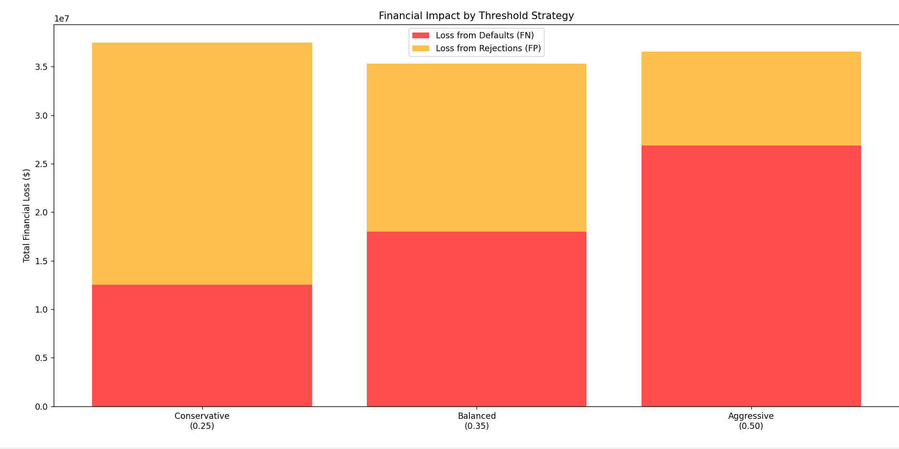
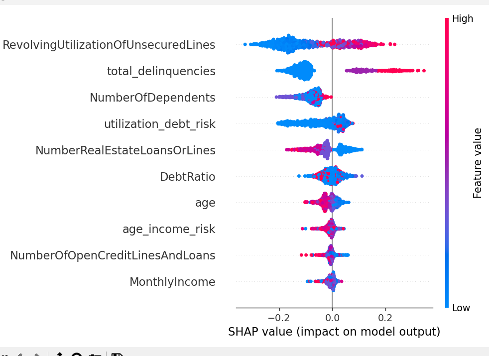
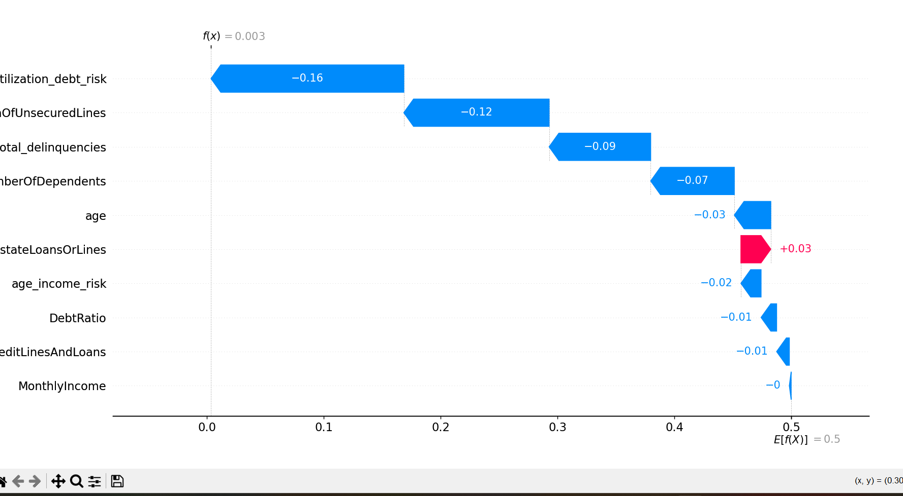

# Credit Risk Decision System

A machine learning system that predicts loan default risk and optimizes 
lending decisions using cost-based threshold optimization.

## Problem Statement
This project aims to retain customers and minimise financial losses from 
defaults by optimising costs. It helps the bank understand losses incurred 
when they lose good customers while accepting defaulters. The system 
categorises customers into three groups and uses SHAP and financial 
simulations to explain rejections and quantify financial impact.

## Dataset
- **Source:** Give Me Some Credit — Kaggle ML Competition (2011)
- **Training:** 150,000 rows
- **Testing:** 101,503 rows
- **Note:** Dataset is from 2011. In production, distribution shift is a 
real concern — borrower behavior post-COVID and changing credit patterns 
may differ. Periodic retraining on recent data would be required.

## Project Structure
| File | Description |
|------|-------------|
| `utils.py` | Reusable preprocessing and feature engineering functions |
| `train_model.py` | Model training, comparison, threshold optimization, model saving |
| `analysis.py` | EDA, outlier detection, distribution checks |
| `explain.py` | SHAP explainability visualizations and feature importance |
| `inference.py` | Predicts loan risk category for new customer data |
| `simulation.py` | Financial impact simulation across threshold strategies |

## How to Run
1. Download dataset from Kaggle: "Give Me Some Credit"
2. Create virtual environment: `python -m venv venv`
3. Activate: `venv\Scripts\activate` (Windows) or `source venv/bin/activate` (Mac)
4. Install dependencies: `pip install -r requirements.txt`
5. Run analysis: `python analysis.py`
6. Train models: `python train_model.py`
7. Generate explanations: `python explain.py`
8. Run predictions: `python inference.py`
9. Run simulation: `python simulation.py`

## Visualizations

### Financial Strategy Comparison

*Balanced threshold (0.35) achieves minimum total loss of $35.3M — 
saving $2.16M vs conservative strategy*

### SHAP Feature Importance (Global)

*RevolvingUtilizationOfUnsecuredLines and total_delinquencies 
are the strongest default predictors*

### SHAP Waterfall — Individual Applicant Explanation

*Example: This applicant has f(x)=0.003 — very low default risk. 
utilization_debt_risk strongly reduces their risk score.*

## Key Results
- **Winning Model:** Tuned Random Forest
- **Optimal Threshold:** 0.38
- **Risk Categories:** APPROVE (<0.35) | REVIEW (0.35-0.55) | REJECT (>0.55)

| Strategy | Threshold | Total Loss |
|----------|-----------|------------|
| Conservative | 0.25 | $37,500,800 |
| **Balanced** | **0.35** | **$35,337,600** |
| Aggressive | 0.50 | $36,528,000 |

## Limitations
- Dataset is from 2011 — potential distribution shift in production
- SMOTE synthetic samples may not perfectly represent real defaulters
- SHAP provides correlation-based explanations, not causal relationships
- Model not tested in live production environment
